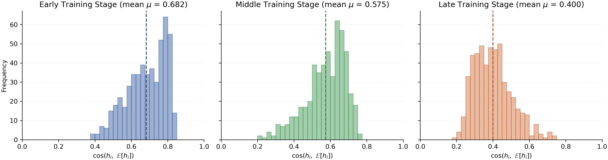
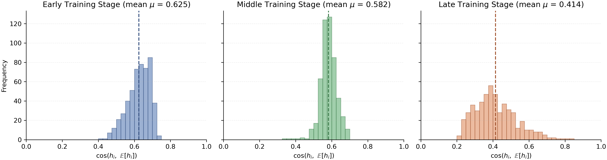

# Empirical Verification of Assumption C.11

---
## CelebA

**Figure I.** Empirical verification of Assumption C.11 on CelebA. We visualize the distribution of cosine similarities $\cos(h_i, \mathbb{E}[h_i])$ across different training stages. The three subplots correspond to early, middle, and late training stages (20%, 50%, and 80% of total training steps), respectively.

---

## Texture Dataset

**Figure II.** Empirical verification of Assumption C.11 on Texture. We visualize the distribution of cosine similarities $\cos(h_i, \mathbb{E}[h_i])$ across different training stages. The three subplots correspond to early, middle, and late training stages (20%, 50%, and 80% of total training steps), respectively.

---

## PACS (Art → Sketch)

_VerifyConeStructure.png)

**Figure III.** Empirical verification of Assumption C.11 on PACS (Art → Sketch). We visualize the distribution of cosine similarities $\cos(h_i, \mathbb{E}[h_i])$ across different training stages. The three subplots correspond to early, middle, and late training stages (20%, 50%, and 80% of total training steps), respectively.
