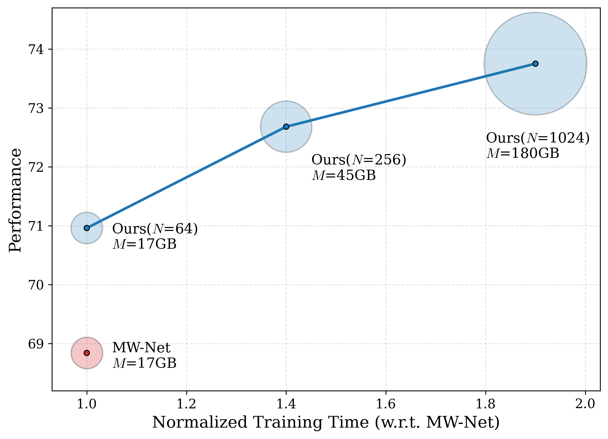

## Computation–Performance Trade-off

  

**Figure 1.** Computational cost–performance trade-off comparing our method with MW-Net. Here, $N$ denotes the batch size. The x-axis shows training time normalized to MW-Net, and the y-axis reports performance. Marker size is proportional to memory usage $M$ (in GB). As $N$ increases, our method consistently achieves higher performance at the cost of increased computation and memory. Notably, even at comparable cost ($N=64$), our method outperforms MW-Net, indicating a better efficiency–performance trade-off.
