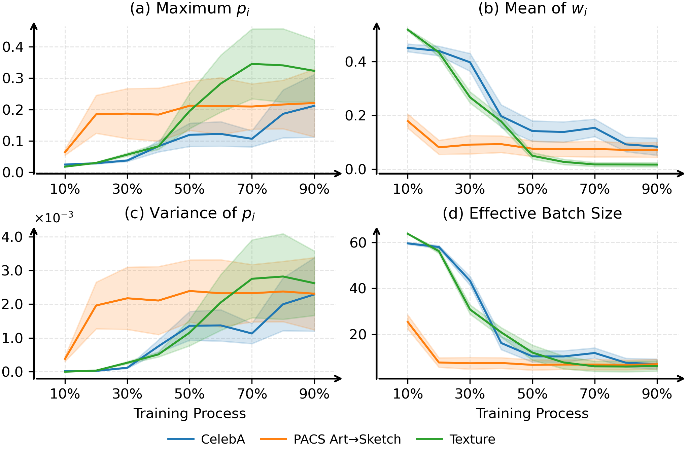
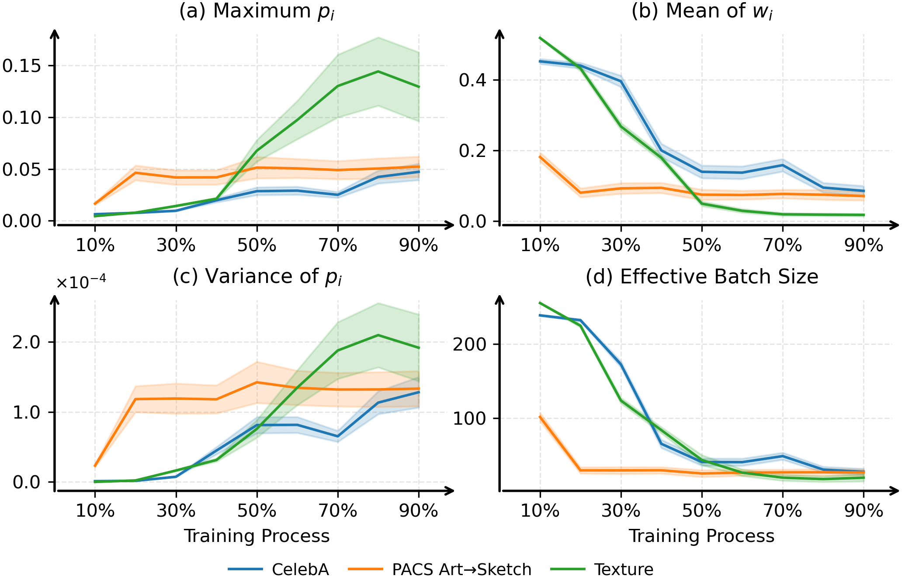
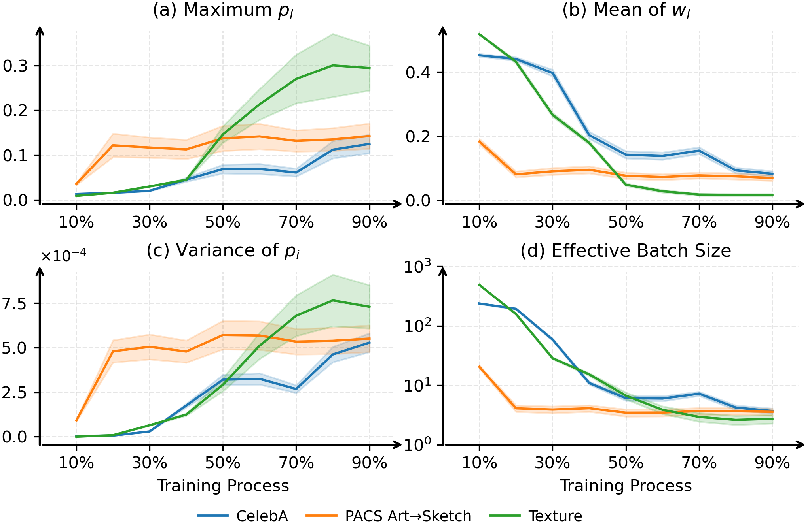
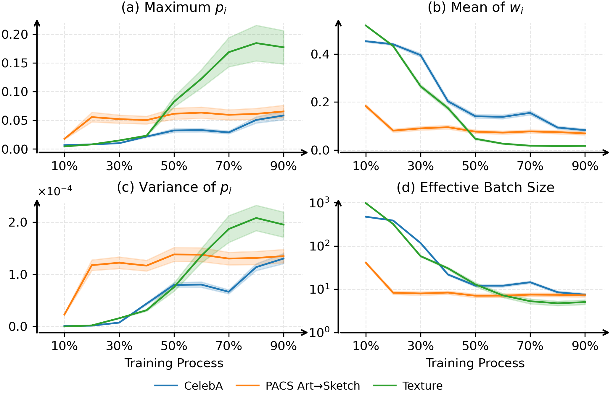

# Training Dynamics Visualization

## Batch Size = 64

  

**Figure I.** Training dynamics for batch size 64: (a) the maximum *normalized* weight $\max_i p_i$, (b) the mean *unnormalized* weight $\hat{\mathbb{E}}[w_i] = S/N$, (c) the variance $\mathrm{Var}(p_i)$, and (d) the effective batch size $B_{\mathrm{eff}} = \left(\sum_i p_i^2\right)^{-1}$. Colors indicate datasets. Shaded regions show mean $\pm$ std across independent batches.

---

## Batch Size = 256

  

**Figure II.** Training dynamics for batch size 256: (a) the maximum *normalized* weight $\max_i p_i$, (b) the mean *unnormalized* weight $\hat{\mathbb{E}}[w_i] = S/N$, (c) the variance $\mathrm{Var}(p_i)$, and (d) the effective batch size $B_{\mathrm{eff}} = \left(\sum_i p_i^2\right)^{-1}$. Colors indicate datasets. Shaded regions show mean $\pm$ std across independent batches.

---

## Batch Size = 512

  

**Figure III.** Training dynamics for batch size 512: (a) the maximum *normalized* weight $\max_i p_i$, (b) the mean *unnormalized* weight $\hat{\mathbb{E}}[w_i] = S/N$, (c) the variance $\mathrm{Var}(p_i)$, and (d) the effective batch size $B_{\mathrm{eff}} = \left(\sum_i p_i^2\right)^{-1}$. Colors indicate datasets. Shaded regions show mean $\pm$ std across independent batches.

---

## Batch Size = 1024

  

**Figure IV.** Training dynamics for batch size 1024: (a) the maximum *normalized* weight $\max_i p_i$, (b) the mean *unnormalized* weight $\hat{\mathbb{E}}[w_i] = S/N$, (c) the variance $\mathrm{Var}(p_i)$, and (d) the effective batch size $B_{\mathrm{eff}} = \left(\sum_i p_i^2\right)^{-1}$. Colors indicate datasets. Shaded regions show mean $\pm$ std across independent batches.

